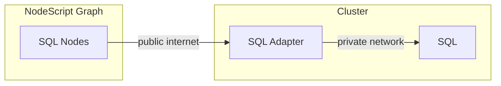

# NodeScript SQL Adapter

Facilitates SQL nodes in [NodeScript](https://nodescript.dev).

## Concepts

In order to communicate to SQL from NodeScript you need to deploy the adapter application.

A single adapter application is able to connect to multiple different SQL databases, thus typically a single adapter deployment is required to facilitate connections to all databases you need. Currently, `PostgreSQL` and `MySQL` are supported. 

NodeScript SQL Adapter is currently available as a docker image at `ghcr.io/nodescriptlang/adapter-sql`.

## Configuration

NodeScript Sql Adapter can be configured with the following environment variables:

- **AUTH_SECRET** — authentication shared secret, used to restrict access from graphs to the adapter.

- **POOL_SIZE** (default: 5) - the maximum number of connections to establish to *each* database the adapter connects to.

- **POOL_TTL_MS** (default: 60_000) - pools created that many millis ago will be recycled (this eliminates connection leaks otherwise occurring with high-throughput scenarios)

- **CONNECT_TIMEOUT_MS** (default: 10_000) — the adapter will throw an error if the connection cannot be established within specified timeout.

- **SWEEP_INTERVAL_MS** (default: 30_000) — the interval at which pools are checked for TTL and closed.

## Observability

NodeScript SQL Adapter exposes the following Prometheus metrics on `/metrics` endpoint:

- `nodescript_sql_adapter_connections` — counters depicting connection pool operations, further narrowed down by the `type` label:

    - `connect` — the connection successfully established, but no connection added to the pool just yet
    - `connectionCreated` — a new connection is added to the pool
    - `connectionClosed` — the pool recycles unused connection
    - `fail` — connection failed

- `nodescript_sql_adapter_latency` — histogram with response latencies, includes the following labels:

    - `method` — one of the endpoint methods (e.g. `findOne`, `updateOne`, `updateMany`, etc.)
    - `error` — the error code, omitted if the response was successful

Refer to the [User Guide](./docs/user-guide.md) for information on using the adapter with nodes in Nodescript.
