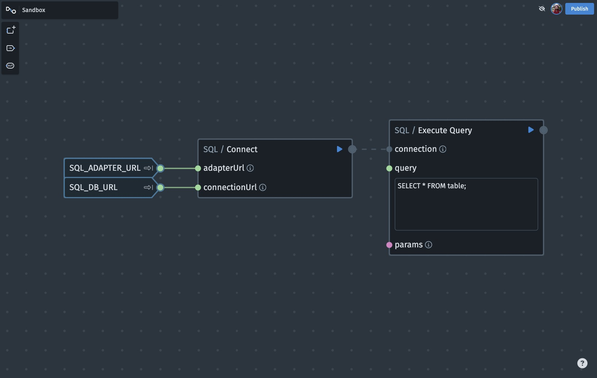

## Usage

1. Ensure your adapter and database are deployed. Refer to the [Readme](./README.md) for guidance.
2. Login to [Nodescript](https://nodescript.dev/login)
3. Either open an existing graph in your chosen workspace, or create a new one.

4. Add a `SQL / Connect` node in a graph, then input your adapter and sql connection urls.
    - These can be securely stored as secrets/variables in the workspace `Variables` section, then accessed in graphs within that workspace and connected to the node, as shown above.
5. Add a `SQL / Query` node and connect the output of the `SQL / Connect` to the `connection` socket.
6. Enter your query into the text field. Optionally, provide a parameters array if you are using a parameterized query.
7. Running the `SQL / Query` node will query your designated database using the connection established with your adapter.
